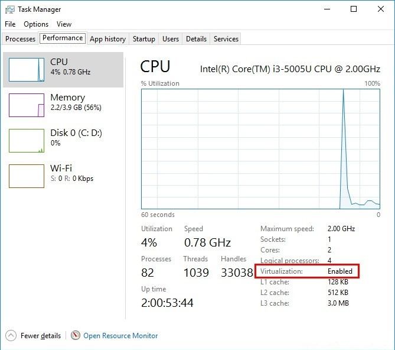
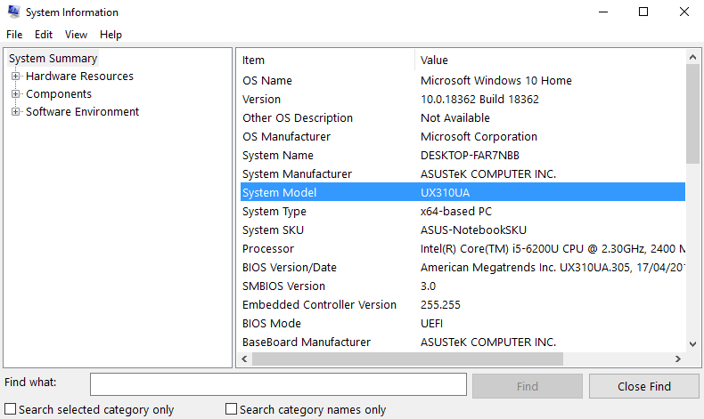
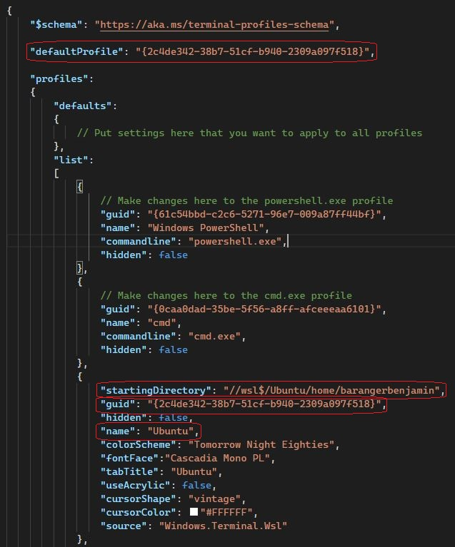
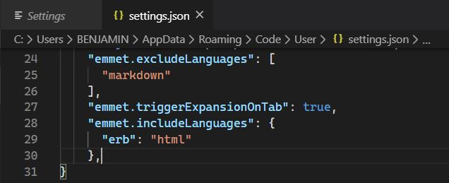
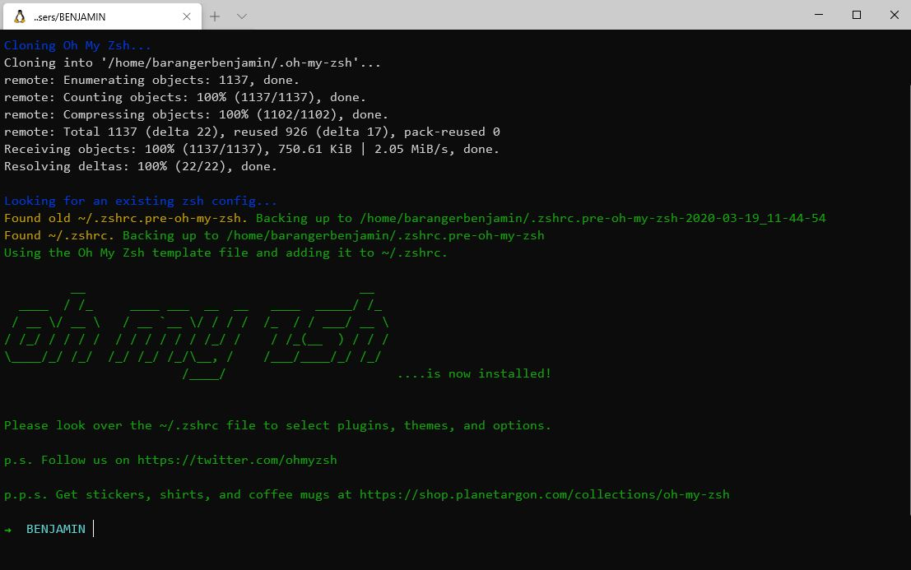

# Setup your machine!

Welcome to this setup where we are going to install the tools required to make your machine a true developer environment :muscle:.

- Install remote tools
- Install a code editor, where you will spend your days and nights
- Install a package manager
- Pimp your Terminal
- Setup git and GitHub
- Install Nodejs
- Install Sqlite
- Install Posgresql
- Install Anaconda


## Prerequisites

Before we start, it is important you meet the following prerequisites to ensure the smooth running of the setup.
Take your time to read through everything and do not hesitate to ask for help if you feel stuck.
Ready? Let's go :sunglasses:

### Latest version of Windows

For this setup, you need to be using the latest version of Windows.

This means that you need to be on Windows 10, with all the latest updates installed.

You can check your software version by clicking on **Start>Settings>System>About**. Look where it says **Edition**. If you see something that starts with "Windows 10..." you're good to go :muscle:.

Not the case? Don't panic :scream: You can always install Windows 10 from [Microsoft]( https://www.microsoft.com/en-gb/windows/get-windows-10) (it should take roughly an hour to install but this is dependent on your computer). Click on **Check for Updates**, then follow the instructions on the screen. Come back to this setup when Windows 10 is installed.

Once you're sure that you're using Windows 10, you will need to check that your computer has all the latest updates. For this click on **Start>Settings>Updates & Security>Windows Update**, then click on **Check updates**. If you have updates available please install them and repeat the process until it says that you are up to date :star:.


### The Insider program

For the best development tools we need to be part of the **Windows Insider** program which gives access to pre-release versions of various tools.

Go to **Start → Settings → Updates & Security → Insider Program**

Click on **Get Started**. It will ask you to **Link an account**; follow the instructions on screen. You will be asked to choose your Insider parameters, choose the second setting, the **fast** one :zap:. Then confirm and restart your computer when you are asked to do so.

After your computer has restarted you can double-check that you are now part of the Insider program by clicking on **Start → Settings → Updates & Security → Insider Program**. You should then be prompted with the Insider parameter that you chose earlier, i.e. **fast**.

By joining the Insider program you have unlocked more content and updates — which we also need to install. Go to **Start → Settings → Updates & Security → Windows Update**, you should see new updates available.
:warning: These updates can take a rather long time of more than 30 minutes, so make sure your computer has enough battery left, and that you won't have to close it during the installation :warning:

Start the update and go grab a coffee :coffee: or tea :tea:.

After your computer has restarted, go to **Start → Settings → System → About**. This time check the **Version**, if it says at least 2004, you are good to go :sunglasses:.

### Virtualization

We need to ensure that the Virtualization options are enabled in the BIOS of your computer.

For many computers, this is already the case. Let's check:

- Press `Ctrl + Alt + Del`.
- Select **Task Manager**.
- Click on the **Performance** tab.
- Click on **CPU**.
- The status will be listed under the graph and will say "Virtualization: Enabled" if this tool is enabled.



If **Virtualization** is already enabled, go directly to [Github account](https://github.com/Joz84/setup/blob/master/WINDOWS.md#github-account).

If not, we need to enable it, which is a process that is different for each model of computer, so we can only offer vague guidelines in this guide. Please ask a teacher as soon as you get stuck!

Let's retrieve your motherboard model :muscle:

Click on **Start** and type **System Information** and open it.

Locate the **System Model** line, the value on the right is your motherboard model.

Now because everything is dependant on your motherboard model, we will have to do a Google search on how to enable the Virtualization option with this model.

:warning: We invite you to contact a teacher so you can complete this part of the setup together, as it might be a bit scary to not have clear guidelines. Choose the communication tool of your choice so the teacher can see your screen (your computer will have to be turned off during the setup so please use your phone, WhatsApp, Facetime etc..) :man_mechanic:​ :warning:

If we take my example:



So I googled "*UX310UA bios enable virtualization*" and the first video in the results taught me how to do it. Part of being a developer is searching for information and applying it to your work :nerd_face:.

Follow the instructions you found to enable Virtualization and come back here, we will be waiting :smile:.


## GitHub account

Have you signed up to GitHub? If not, [do it right away](https://github.com/join).

:point_right: **[Upload a picture](https://github.com/settings/profile)** and put your name correctly on your GitHub account. This is important as we'll use an internal dashboard with your avatars. Please do this **now**, before you continue with this guide.


## Remote tools

To be able to interact when we are not in the same physical room, we will be using two tools:

### Zoom

Zoom is a video conferencing tool. To create an account and install the app, go to [https://zoom.us/download](https://zoom.us/download) and under **Zoom Client for Meetings** click the **Download** button. Open the file you have just downloaded. A progress bar will appear, then Zoom will start. Click on **Connection** and create an account with the **Sign Up Free** option:


Once connected, you should see:


You can close Zoom now.


## Windows Subsystem for Linux

WSL is the development environment we are using to run Ubuntu. You can learn more about WSL [here](https://docs.microsoft.com/en-us/windows/wsl/faq).

Click on **Start** and type **powershell**. Right click on **Windows Powershell**, then on **Run as administrator**. A blue terminal window will appear. Copy the following commands, paste them into the terminal windows by right-clicking into it, and run them by pressing Enter:

(If you are asked to restart your computer, type **n** and **enter** to prevent your computer from restarting at that moment).

```powershell
Enable-WindowsOptionalFeature -Online -FeatureName Microsoft-Windows-Subsystem-Linux
```

```powershell
dism.exe /online /enable-feature /featurename:Microsoft-Windows-Subsystem-Linux /all /norestart
```

```powershell
dism.exe /online /enable-feature /featurename:VirtualMachinePlatform /all /norestart
```

When all three commands ran without any errors, restart your computer.

Once your computer has restarted, click on **Start** and type **Microsoft Store**. Launch it. In the search bar, type **Ubuntu**. Click on the result that says **Ubuntu** plainly, not **Ubuntu 18.04 LTS**. Then, click on **Install**.

:warning: There is no progress bar for this installation. When it is done you will be asked, in the bottom right corner, to launch it.

The first time you open WSL - you will be asked to choose a username :warning:. Your username should be **one word**, **lowercase** with no **special characters** :warning:, for example: `jonathanserafini`.

It will then ask you for a new password. When you type your password, :warning: it will not appear on the screen :warning: – and there will be no familiar typing indicator even though your keystrokes are being registered. This is a security feature to mask not only your password as a whole but also its length!

You will have to retype your password, and then the installation should be complete.

You can close the terminal now that WSL is installed on your computer.


### Upgrade to WSL 2

First, we need to download the [WSL2 installer](https://aka.ms/wsl2kernel). Click on the suggested link to download the update package and once it is downloaded, open the program.


Click on **Next**, then **Finish**.

We also need to make sure that the program files are not compressed. Let's enable an option to let you see hidden files/folders :female_detective:. Click on **Start**. In the search bar type **folder**, open the folder options. Click on the second tab **View**, then under **Hidden files and folders**, select **Show hidden files, folders, and drives**. Click on **Apply**, then **Ok** to close this window.

Open a file explorer. In the sidebar click on **This computer** → **Windows (C:)** → **Users** → **your username account** → **AppData** → **Local** → **Packages**. Here you need to locate the folder starting with **CanonicalGroupLimited.UbuntuonWindows** and open it.

Locate the **LocalState** folder and **right click** on it, then click on **Properties** → **Advanced**.

Make sure that the option **Compress content** is **not** ticked. Click on **Ok** to validate your choice. You will be asked if you want to apply this change only to this folder, or also the subfolders. Please choose only this folder.

Click on **Start**. In the search bar type **cmd**, open the **Command Prompt**.
You will see all the WSL updates installed on your machine with the command:

```bash
wsl -l -v
```
(translates to "wsl list version")

You should see the Ubuntu version that you installed before.

Let's upgrade it to the version 2, by running the following command:

```bash
wsl --set-version Ubuntu 2
```

A message will appear telling you that the conversion is in progress and that it will take a few minutes.

When you get the message **The conversion is complete**, paste the first command into the command prompt again:

```bash
wsl -l -v
```

and double-check that the version is now **2**.


## Windows Terminal

As with Ubuntu, click on **Start**, type **Microsoft Store**, and launch it.

In the search bar, type **terminal**, then in the list of results, click on **Windows Terminal (Preview)**.

Install it, and afterwards **reboot** your computer.

After the restart, click on **Start** and type **terminal**. Open **Windows Terminal (Preview)**

This terminal allows you to open multiple terminal tools, including **Powershell**, **Command Prompt**, and **Ubuntu** that you installed earlier :point_up_2: This terminal has tabs. Locate the **down arrow** / v-shape next to the open tab, and click on it. It will show you all the terminals you can open from here, but for the rest of this guide, we will only need **Ubuntu**.


Let's make Ubuntu the default terminal of your Windows terminal application. Press **`Ctrl` + `,`**. It should open the settings:



We have put in red the important parts.
Locate the `"name": "Ubuntu",`.
Add the following line after it (**don't forget the comma at the end**):
```bash
"startingDirectory": "//wsl$/Ubuntu/home/the-session-name-you-chose-at-the-ubuntu-install",
```

Locate the `"guid"` in red, copy the value between `{` and `}`.

Locate the `"defaultProfile"` and replace the value between `{` and `}` with what you copied from above.

Voilà, your **Windows Terminal** :confetti_ball: is setup! From now on, every time we will refer to the terminal/console it will be this one.

## Git

To install `git`, first open an Ubuntu terminal. To open an Ubuntu terminal, hit **Start**, type **windows terminal**, and click on **Windows Terminal (Preview)**, then open an **Ubuntu** tab via the drop-down menu next to the already open Windows Powershell tab.

Then copy and paste the following lines **one line at a time** (note that you can paste by doing a right click in the terminal):

```bash
sudo apt update
```
```bash
sudo apt install -y git apt-transport-https unzip gnome-terminal
```


## Visual Studio Code

We use Visual Code Studio for writing code on Windows, because it integrates nicely with the Ubuntu terminal.

For this integration to work, you need to uninstall other code editor, like for example SublimeText, as their WSL integration interferes with the integration of VS Code.

Go the [Visual Studio Code page](https://code.visualstudio.com/download) and click on Windows. The tool should start to download automatically. Open the file you have just downloaded. Install it leaving all the default options as they are.

To help VS Code interact with your terminal, we need to add the extension **Remote Development**. Go to the [extension page](https://marketplace.visualstudio.com/items?itemName=ms-vscode-remote.vscode-remote-extensionpack) and click on **Install**. This will tell you that VS Code is required to install this extension. Click on **Continue**. You will get an alert asking you to open Visual Studio Code. The editor will open to the extension page.


Click on **Install**.
Click on **File → Preferences → Keymaps**. Click on **Sublime Text Keymap and Settings Importer**.
Click on **Install**. Click on **Reload Required**

Let's gain time now and add the Ruby on Rails support for your code editor. Go to the [extension page](https://marketplace.visualstudio.com/items?itemName=hridoy.rails-snippets) and follow the same steps as the Remote Development one.

Press `Ctrl` + `,` on your keyboard to open the settings. In the search bar, type **emmet**. Click on **Edit in settings.json**
Paste the following just before the last **`}`**
```bash
"emmet.triggerExpansionOnTab": true,
"emmet.includeLanguages": {
  "erb": "html"
},
```
It should look like this:



You should add a comma if there is none after the **`]`** like line 26 in the image above ☝️

To make sure everything works fine, open your terminal and type:
```bash
code
```
If Visual Studio Code opens, your code editor is ready :muscle:.
Please call a teacher if it doesn't.


## Oh-my-zsh - Fancy your Terminal

We will use the shell named `zsh` instead of `bash`, the default one.

```bash
# it will ask for your session password
sudo apt install -y zsh curl vim nodejs imagemagick jq
```
```bash
sh -c "$(curl -fsSL https://raw.githubusercontent.com/robbyrussell/oh-my-zsh/master/tools/install.sh)"
```

At then end, your terminal should look like this:



If it doesn't, **ask a teacher**.


## GitHub

We need to generate SSH keys which are going to be used by GitHub and Heroku
to authenticate you. Think of it as a way to log in, but different from the
well known username/password couple. If you already generated keys
that you already use with other services, you can skip this step.

Open a terminal and type this, replacing the email with **yours** (the
same one you used to create your GitHub account). It will prompt
for information. Just press enter until it asks for a **passphrase**.

```bash
mkdir -p ~/.ssh && ssh-keygen -t ed25519 -o -a 100 -f ~/.ssh/id_ed25519 -C "TYPE_YOUR_EMAIL@HERE.com"
```

**NB:** when asked for a passphrase, put something you want (and that you'll remember),
it's a password to protect your private key stored on your hard drive. You'll type,
nothing will show up on the screen, **that's normal**. Just type the passphrase,
and when you're done, press `Enter`.

Then you need to give your **public** key to GitHub. Run:

```bash
cat ~/.ssh/id_ed25519.pub
```

It will prompt on the screen the content of the `id_ed25519.pub` file. Copy that text,
then go to [github.com/settings/ssh](https://github.com/settings/ssh). Click on
**Add SSH key**, fill in the Title with your computer name, and paste the **Key**.
Finish by clicking on the **Add key** green button.

To check that this step is completed, in the terminal run this. You will be
prompted a warning, type `yes` then `Enter`.

```bash
ssh -T git@github.com
```

If you see something like this, you're done!

```bash
# Hi --------! You've successfully authenticated, but GitHub does not provide shell access
```

If it does not work, try running this before trying again the `ssh -T` command:

```bash
ssh-add ~/.ssh/id_ed25519
```

Don't be in a rush, take time to [read this article](http://sebastien.saunier.me/blog/2015/05/10/github-public-key-authentication.html) to get a better
understanding of what those keys are used for.


## Nodejs

This is not used at the beginning of the course, but let's get a head start and install nodejs, used for Javascript :thumbsup:.

Copy paste the following commands:
```bash
curl -sL https://deb.nodesource.com/setup_10.x | sudo -E bash -
```
```bash
sudo apt install -y nodejs
```

Check that everything went well by launching the Jupyter program

```bash
node
```

You should see this :

```bash
Welcome to Node.js v14.3.0.
Type ".help" for more information.
>
```

Type `.exit` to exit.


## Dotfiles (Standard configuration)

Hackers love to refine and polish their shell and tools. We'll start with a great default configuration (http://github.com/Joz84/dotfiles), stored on GitHub. As your configuration is personal, you need your own repository storing it, so you first need to fork it to your GitHub account.

:arrow_right: [Click here to **fork**](https://github.com/Joz84/dotfiles/fork) the `dotfiles` repository to your account.

You should arrive on a page that looks like this. Make sure to **select your GitHub account**.


Forking means that it will create a new repo in your GitHub account, identical to the original one. You'll have a new repository on your GitHub account, `your_github_username/dotfiles`. We need to fork because each of you will need to put specific information (e.g. your name) in those files.

Open your terminal. **Don't blindly copy paste this line**, replace `replace_this_with_your_github_username` with *your*
own github usernickname.

```bash
export GITHUB_USERNAME=replace_this_with_your_github_username

# Example:
#   export GITHUB_USERNAME=ssaunier
```

Now copy/paste this very long line in your terminal. Do **not** change this one.

```bash
mkdir -p ~/code/$GITHUB_USERNAME && cd $_ && git clone git@github.com:$GITHUB_USERNAME/dotfiles.git
```

Run the `dotfiles` installer.

```bash
cd ~/code/$GITHUB_USERNAME/dotfiles
```
```bash
zsh install.sh
```

Then run the git installer:

```bash
cd ~/code/$GITHUB_USERNAME/dotfiles
```
```bash
zsh git_setup.sh
```

:point_up: This will **prompt** you for your name (`Firstname Lastname`) and your email.

Be careful, you **need** to put the **same** email as the one you sign up with on GitHub.

Copy the following command in your terminal to open the `~/.zshrc` profile file in Visual Code Studio:
```bash
code ~/.zshrc
```
Locate the line `# Actually load Oh-My-Zsh` and **above it** write the following line:
```bash
ZSH_DISABLE_COMPFIX=true
```


You don't want to be asked for your passphrase every time you communicate with a distant repository. So you need to add the plugin `ssh-agent` to `oh my zsh`.
Spot the line starting with `plugins=` Then add `ssh-agent` to the plugins list. The list should look like:

```
plugins=(gitfast last-working-dir common-aliases sublime zsh-syntax-highlighting history-substring-search ssh-agent)
```
Save the `.zshrc` file with `Ctrl` + `S` and close Visual Code Studio.

## Sqlite

Open a terminal and run the following:

```bash
sudo apt-get install sqlite libsqlite3-dev
```

Check that everything went well by launching the Jupyter program

```bash
sqlite3 db.sqlite
```

You should see this :

```bash
SQLite version 3.31.1 2020-01-27 19:55:54
Enter ".help" for usage hints.
sqlite>
```

Type `.exit` to exit.


## Postgresql

In a few weeks, we'll talk about SQL and Databases and you'll need something called Postgresql,
an open-source robust and production-ready database. Let's install it now.


```bash
sudo apt install -y postgresql postgresql-contrib libpq-dev build-essential
```
```bash
sudo /etc/init.d/postgresql start
```
```bash
sudo -u postgres psql --command "CREATE ROLE `whoami` LOGIN createdb;"
```

You can configure PostgreSQL to autostart, so you don't have to execute `sudo /etc/init.d/postgresql start` each time you open a new terminal:

```bash
sudo echo "`whoami` ALL=NOPASSWD:/etc/init.d/postgresql start" | sudo tee /etc/sudoers.d/postgresql
```
```bash
sudo chmod 440 /etc/sudoers.d/postgresql
```
```bash
echo "sudo /etc/init.d/postgresql start" >> ~/.zshrc
```

Once you've done that, let's check if it worked:

```bash
psql -d postgres
```

If you enter a new prompt like this one, you're good!

```bash
psql (9.5.3)
Type "help" for help.

postgres=#
```

To quit it, type `\q` then `Enter`.


## Anaconda (Python + librairies + notebook)


### Prerequisites

To use GUI packages with Linux, you will need to install the following extended dependencies for Qt:

```bash
apt-get install libgl1-mesa-glx libegl1-mesa libxrandr2 libxrandr2 libxss1 libxcursor1 libxcomposite1 libasound2 libxi6 libxtst6
```

### Installation

the installation of anaconda also includes the installations of :
- Python
- Pandas
- Matplotlib
- Numpy
- SciPy
- notebook Jupyter

Open a terminal and run the following:

```bash
mkdir -p ~/code/tools && cd $_
```

Download the latest version with this command line:

```bash
wget https://repo.anaconda.com/archive/Anaconda3-2020.02-Linux-x86_64.sh
```

The file is quite large, and may take a few seconds to be applied.

```bash
bash Anaconda3-2020.02-Linux-x86_64.sh
```
Include the bash command regardless of whether or not you are using Bash shell.

This starts the installation process of Anaconda. You will need to accept the license agreement. Choose to install Anaconda in the default directory, and wait. At the end of the installation, answer `no` to the following question:

```bash
Do you wish the installer to prepend the Anaconda3 install location
to PATH in your /home/ec2-user/.bashrc ? [yes|no]
```

```bash
cd anaconda3/bin/
echo export PATH='"'`pwd`':$PATH"' >> ~/.zshrc
cd
```

Previous commands added to the file. zshrc the path (folder) where Anaconda is located. So you can launch Anaconda directly by typing only `anaconda` in your console! This will take effect when your computer is restarted, or upon execution of this command:

```bash
source ~/.zshrc
```

Check that everything went well by launching the Jupyter program

```bash
jupyter notebook
```

